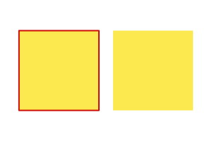
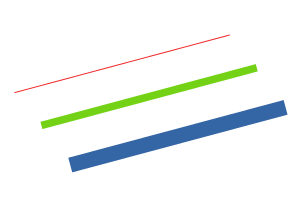
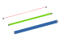

svgoutline
==========

This Python library extracts all strokes (outlines) from an SVG vector graphics
file as a series of straight line segments appropriate for driving pen plotters
or desktop cutting machines.

Key features:

* **Supports most common SVG features** including beziers, shapes, simple text,
  dashed lines and object/layer visibility. Converts all of these
  into simple straight line segments with no transformations required:
  
  
  
  
* **Ignores out non-stroked objects.**
  
  
  
  
* **Curves are approximated by straight lines** with user-defined fidelity.
  
  
  
  
  
  
* **Captures stroke colours** in RGBA format and millimetres respectively (e.g.
  to allow colour/thickness dependent cutting/plotting settings).
  
  
  
  

Limitations:

* **Only [SVG Tiny 1.2](https://www.w3.org/TR/SVGTiny12/) is supported** due to the
  use of [Qt SVG](http://doc.qt.io/qt-5/qtsvg-index.html) internally. The
  following significant features are missing which you might otherwise expect:
  * Clipping masks are not supported and will be ignored.
  * Many text features beyond simple single-line text strings are not
    supported, for example text on path, line wrapping or style changes mid
    text element.
* **Depends on [Qt for Python (a.k.a.
  PySide2)](https://wiki.qt.io/Qt_for_Python).**  This is a relatively
  non-trivial dependency but is easy to install from
  [PyPI](https://pypi.org/project/PySide2/) on most platforms. Unfortunately it
  makes svgoutline subject to the same bugs (e.g.
  [QTBUG-72997](https://bugreports.qt.io/browse/QTBUG-72997) which at the time
  of writing causes text outlines and dash patterns to render too small).
* **Oblivious to fills and overlaps.** Consequently, if two shapes overlap,
  their full outlines will be included in the output regardless of what parts
  of their outlines are actually visible. For plotting purposes this should not
  be a significant problem as input SVGs are unlikely to contain filled
  elements.
* **Output does not distinguish between closed paths and paths whose start and
  end coordinates are the same.** This distinction is not important for most
  plotting applications.

Usage
-----

Install from PyPI:

    $ pip install svgoutline

Provide a valid SVG deserialised from XML using Python's [`ElementTree`
API](https://docs.python.org/3/library/xml.etree.elementtree.html):

    >>> import xml.etree.ElementTree as ET
    >>> from svgoutline import svg_to_outlines
    
    >>> tree = ET.parse("example.svg")
    >>> root = tree.getroot()
    
    >>> outlines = svg_to_outlines(root)

Where `outlines` will be a `list` of lines of the form:

    [
        ((r, g, b, a), line_width, [(x, y), ...]),
        ...
    ]

With `r`, `g`, `b` and `a` being between 0.0 and 1.0, and with `line_width` and
the coordinates being given in millimetres.

See `help(svg_to_outlines)` (or
[`svg_to_outlines.py`](./svgoutline/svg_to_outlines.py)) for full usage
information.

Alternatively, a quick'n'dirty demo script is provided in `samples/demo.py`
which generates the examples above given an SVG file as input. See `python
samples/demo.py --help` for more information.

Tests
-----

The tests are written using [py.test](https://docs.pytest.org/en/latest/) and
test dependencies can be installed and the tests executed with:

    $ pip install -r requirements-test.txt
    $ py.test tests

The code adheres to the Python [PEP8 style
guide](https://www.python.org/dev/peps/pep-0008/) and is checked using
[flake8](http://flake8.pycqa.org/en/latest/) (installed with py.test in the
commands above). Run it using:

    $ flake8 tests svgoutline

License
-------

GNU Lesser General Public License v3 (LGPLv3)
